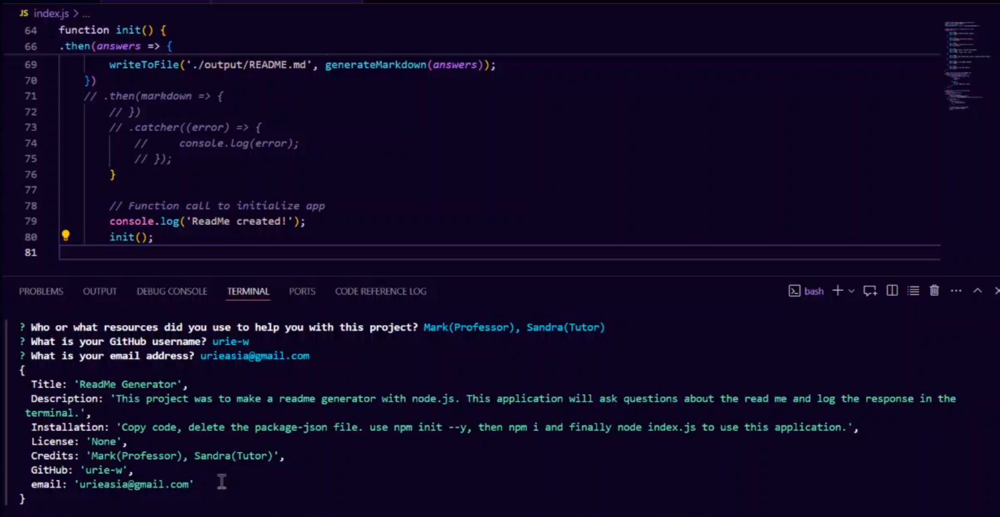

# ReadMe Generator

  ## Description
  This is a readme generator that will help you create a README file using node.js. This will help you create a README file in a quick and easy way. When you run the program you will be asked a series of questions and you will input your answers. Once all the questions are answered you will have a read me filled out inside the terminal.

  ## Installation
  Copy the code inside the repository. Open it in your terminal and delete the package-json file. Inside the terminal run "npm init --y" then "npm i" then lastly run "node index.js". Once that is done you will be able to answer the questions and create a README file.

  ## Usage
  A quick way to create a README file.

  ## Images
  
  
  ## Table of Contents
  *[Description](#description)
  *[Installation](#installation)
  *[Usage](#usage)
  *[Credits](#credits)
  *[License](#license)
  *[GitHub](#github)
  *[Questions](#questions)

  ## Credits: Mark, Sandra, and StackOverflow.

  ##License
  None

  ##Questions
  GitHub Link (https://github.com/urie-w)
